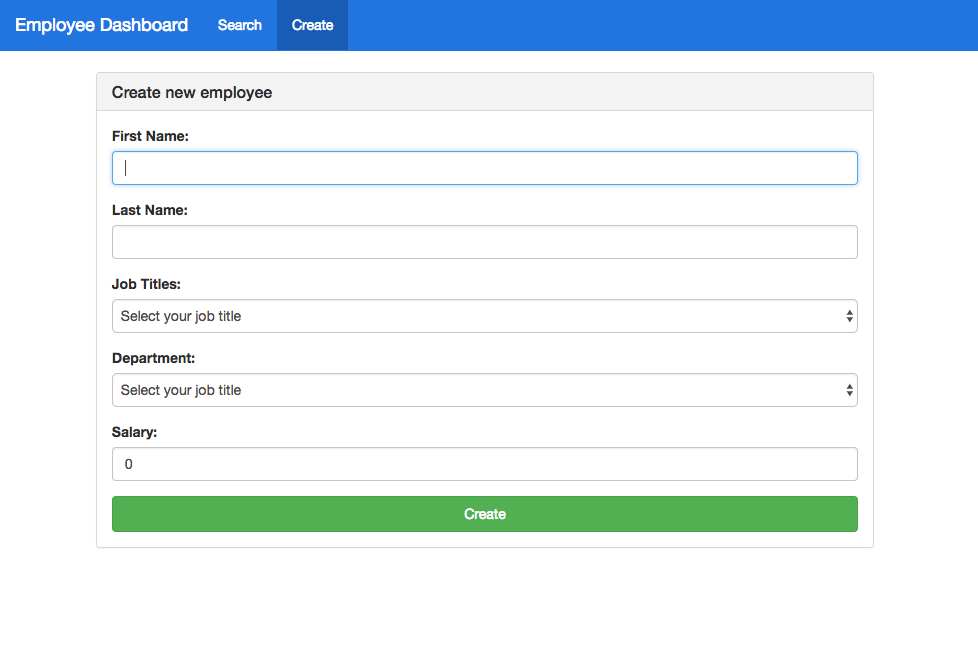

# React fullstack app - Employee Dashboard

- Client: **React.js**
- Server: **Node/Express.js**
- Database: **MongoDB**

## Live Demo:
https://powerful-springs-20093.herokuapp.com/

## Features

- Pagination
- Form
- Filter
- Function as Child Component
- Callback Refs
- RESTful API 
- Data Source: https://catalog.data.gov/dataset/current-employee-names-salaries-and-position-titles-840f7

